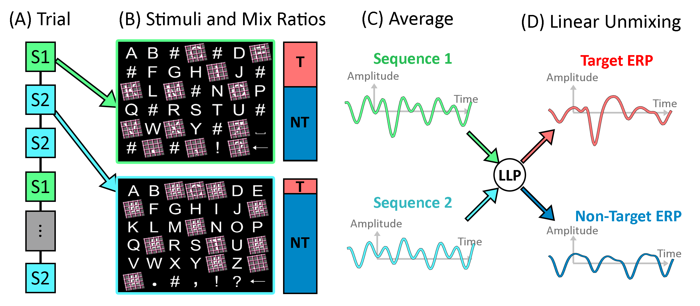

# Unsupervised-BCI-Matlab
Unsupervised Learning for Event-Related Potential based Brain-Computer Interfaces.

## Overview
The provided code is a standalone Matlab implementation of the MIX method proposed by Thibault Verhoeven et al. in

> Verhoeven, T., Hübner, D., Tangermann, M., Müller, K.-R., Dambre, J., & Kindermans, P.-J. (2017). Improving zero-training brain-computer interfaces by mixing model estimators. Journal of Neural Engineering, 14(3), 036021.

This method allows a user to control an event-related potential (ERP) speller without a calibration phase. It continously learns from unlabeled data, i.e. when the user's intentions are unknown. The decoding performance is almost as good as a comparable supervised method with the same amount of data and full label access. Hence, this plug & play system is a powerful alternative to traditional supervised methods. For a visual ERP speller, about 3 minutes of unlabelled data are sufficient to perfectly decode the attended symbols.

## Get Started

Two simple steps are necessary to run this code. First, you have to download the example data set (__online_study_1-7.zip__ & __sequence.mat__) from Zenodo https://zenodo.org/record/192684 and extract it. Second, you have to clone this Github repository. Then you can open `example_script.m`, replace `your_data_path` with the data directory where you extracted the data and run it. The functions were tested with Matlab 2014b. The Matlab output should read something like:

    -------Start simulating online experiment!--------
    The classifier starts from a random initalization and is retrained after each trial.
    The binary target-vs-non target area under the curve (AUC) on all data 
    until the current trial is then reported, if label information are available.
    Additionally, the mixing coefficient for the target and non-target classes are reported.
    -----------------------------------------------------

    Trial   1. AUC: 64.663%. Gamma_pos: 0.370, Gamma_neg: 0.713. Runtime: 0.081s
    Trial   2. AUC: 70.162%. Gamma_pos: 0.271, Gamma_neg: 0.476. Runtime: 0.085s
    Trial   3. AUC: 78.980%. Gamma_pos: 0.245, Gamma_neg: 0.379. Runtime: 0.230s
    Trial   4. AUC: 76.728%. Gamma_pos: 0.230, Gamma_neg: 0.329. Runtime: 0.137s
    Trial   5. AUC: 82.918%. Gamma_pos: 0.226, Gamma_neg: 0.311. Runtime: 0.198s
    Trial   6. AUC: 87.837%. Gamma_pos: 0.217, Gamma_neg: 0.272. Runtime: 0.267s
    Trial   7. AUC: 86.641%. Gamma_pos: 0.217, Gamma_neg: 0.249. Runtime: 0.295s
    Trial   8. AUC: 90.805%. Gamma_pos: 0.200, Gamma_neg: 0.227. Runtime: 0.293s
    Trial   9. AUC: 92.076%. Gamma_pos: 0.196, Gamma_neg: 0.210. Runtime: 0.326s
    Trial  10. AUC: 93.401%. Gamma_pos: 0.211, Gamma_neg: 0.218. Runtime: 0.362s
    Trial  11. AUC: 97.160%. Gamma_pos: 0.215, Gamma_neg: 0.215. Runtime: 0.381s
    Trial  12. AUC: 97.817%. Gamma_pos: 0.224, Gamma_neg: 0.219. Runtime: 0.666s
    Trial  13. AUC: 97.800%. Gamma_pos: 0.236, Gamma_neg: 0.228. Runtime: 0.447s
    Trial  14. AUC: 97.988%. Gamma_pos: 0.237, Gamma_neg: 0.224. Runtime: 0.495s
    Trial  15. AUC: 97.893%. Gamma_pos: 0.244, Gamma_neg: 0.227. Runtime: 0.543s
    Trial  16. AUC: 97.764%. Gamma_pos: 0.260, Gamma_neg: 0.244. Runtime: 0.572s
    Trial  17. AUC: 98.000%. Gamma_pos: 0.258, Gamma_neg: 0.241. Runtime: 0.636s
    Trial  18. AUC: 98.327%. Gamma_pos: 0.265, Gamma_neg: 0.247. Runtime: 0.696s
    Trial  19. AUC: 98.387%. Gamma_pos: 0.263, Gamma_neg: 0.244. Runtime: 0.634s
    Trial  20. AUC: 98.411%. Gamma_pos: 0.268, Gamma_neg: 0.247. Runtime: 0.949s
    Trial  21. AUC: 98.346%. Gamma_pos: 0.264, Gamma_neg: 0.240. Runtime: 0.732s
    Trial  22. AUC: 98.241%. Gamma_pos: 0.267, Gamma_neg: 0.241. Runtime: 0.717s
    Trial  23. AUC: 98.181%. Gamma_pos: 0.270, Gamma_neg: 0.247. Runtime: 0.796s

    -----------------------------------------------------
    Simulation completed.
    Find the final classifier in C.classifier.
    Statistics are saved in C.statistics.
    -----------------------------------------------------

    Final sentence: franzy jagt im komplett

Of course, you can also use the algorithm with your own data. Just make sure that the data is in the right format and satisfies the prerequisites of the algorithms (see below).

## Background

The proposed MIX method is an analytical combination of two other unsupervised learning method. Depending on the variance of the individual estimators, it assigns a higher or lower weight to the invididual classifier. 

The first one is an __Expectation-Maximization (EM)__ algorithm for a Gaussian mixture model. It was initially proposed for brain-computer interfaces by Pieter-Jan Kindermans et al. in 2012:

> Kindermans, P. J., Verstraeten, D., & Schrauwen, B. (2012). A Bayesian model for exploiting application constraints to enable unsupervised training of a P300-based BCI. PloS one, 7(4), e33758.

The EM heavily utilizes that ERP paradigms introduce a certain structure in the data: Knowing the attended symbol uniquely determines for each highlighting event (e.g. row or column intensification in the classical matrix speller by Farwell & Donchin), whether it was a target or non-target. Hence, we can define the attended symbol as the latent variable. The algorithm then proceeds by alternatively estimating the value of the latent variable [E-step] and maximizes the parameter given these estimates [M-step]. It is known to work well in practice, even though no theoretical guarantees exist regarding convergence. The initialisation is random.

The second unsupervised learning method is __Learning from Label Proportions (LLP)__. It was first applied to BCI by Hübner et al. in 2017:

> Hübner, D., Verhoeven, T., Schmid, K., Müller, K.-R., Tangermann, M., & Kindermans, P.-J. (2017). Learning from label proportions in brain-computer interfaces: Online unsupervised learning with guarantees. PloS one, 12(4), e0175856.

It relies on a simple general principle by Quadrianto et al. (2009), that allows inferring information about class means when the unlabelled data can be divided into at least two sub-groups that have different, but known class proportions. Then, the class means can be found by solving a simple linear system of equations.

> Quadrianto, N., Smola, A. J., Caetano, T. S., & Le, Q. V. (2009). Estimating labels from label proportions. Journal of Machine Learning Research, 2349-2374.

To enable this approach in BCI, a modification of the paradigm is necessary. Additional '#'-symbols are introduced to the spelling grid which take the role of visual blanks and as such, are never attended by the user. Now, two sequences S1 and S2 are introduced where S1 highlights only highlights ordinary symbols and S2 also highlights the visual blank '#' symbols. This leads to a higher probability of highlighting the attended character in S1 than in S2. These different probabilities can be quantified by (known) target and non-target ratios. S1 and S2 are hence, a linear combination of target and non-target events. The target and non-target class means can then be reconstructed by averaging the responses for S1 and S2 and solving the linear system, see the schematic overview:

Other ERP paradigms naturally have these different target to non-target ratios, e.g., in paradigms with a two-step selection procedure, where the number of items differs in the first and second step. LLP is determinstic. It was shown to outperform EM when only unlabeled data from a few trials is avaialable, but falls behind when more data is available.
___

@David Hübner, 10.8.2017. 
Contact: david.huebner@blbt.uni-freiburg.de
